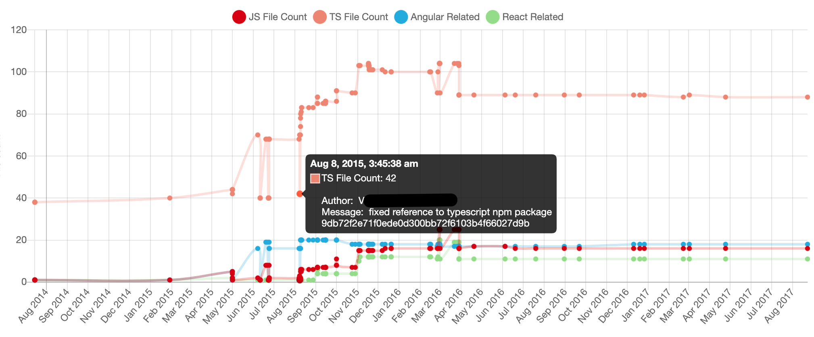

# Git Metric
Git Metric is a tool for tracking file-based metrics in a git repository. Git Metric is ideal for projects with an ongoing incremental migration, for example:
* Migrating from AngularJS to React
* Migrating from JavaScript to TypeScript
* Any incremental removal of an old library or framework

Git Metric provides commit-based metrics, which can be easily displayed on a chart to provide meaningful insights.

See below the output of the example usage, which analyzes the [TypeScriptSamples](https://github.com/microsoft/TypeScriptSamples) repository. The chart shows the number of  JS, TS, Angular-related and React-related files for each commit in the repository.


Git Metric is extremely fast, and can be used with projects with various sizes and ages.
Please note: if you need to collect metrics which depends on more than just the files content (like code coverage or complitation warnings), this tool can't help you.


## How it works
When used, Git Metric will:
* Fetch the repository's commits the git history using [gitlog](https://www.npmjs.com/package/gitlog).
* Calculate the metrics for each commit using [git ls-tree](https://git-scm.com/docs/git-ls-tree) and [git grep](https://git-scm.com/docs/git-grep).

Git Metric is written in TypeScript, and supplies `d.ts` files for you convenience.

## Installation
```bash
npm install git-metric
```

## Usage
```js
import gitMetric from 'gitMetric';

gitMetric.run({
    repositoryPath: '/full/path/to/repo',
    trackByFileExtension: { // Tracks a metric by the file extension
        'Extension Metric 1': ['glob1', 'glob2'], // Each extension metric secifies the globs to look for
        // For example:
        'JS File Count': ['**.js', '**.jsx'],
        'TS File Count': ['**.ts', '**.tsx'],
    },
    trackByFileContent: { // Tracks a metric by the file's content
        'Content Metric 1': { // Each file content metric specifies the file globs and the phrase to look for in each file:
            globs: ['glob10', 'glob20',],
            phrase: 'some_phrase',
        },
        // For example:
        'React Related': {
            globs: ['**.js', '**.jsx', '**.ts', '**.tsx'],
            phrase: 'react'
        },
    },
    commitsSince: '1-15-2010', //MM-DD-YYYY
    commitsUntil: '11-18-2021', //MM-DD-YYYY
    maxCommitsCount: 450,
}).then(commitsWithMetrics => {
    // Resolves with details about each commit, along with its metric. See below.
})
```

`run()` resolves with an array of commits with metrics. Each element in the result contains two properties:
1. `metrics` - a map between a configured metric, and its value for this commit. A result for the configuration from the usage example will look like the following:
```js
{
    'Extension Metric 1': 23
    'JS File Count': 174,
    'TS File Count': 320,
}
```
2. `commit` - additional details about the commit: `hash`, `authorName`, `subject`, `authorDate`, `authorEmail`, `files` and `status`. The details are provided by [gitlog](https://www.npmjs.com/package/gitlog).


*Psst*.. If you only want a one-time analyze of your project, you can just adjust the example code for your need.

### Running the Example
1. Clone the repo - `git clone https://github.com/omril321/git-metric.git`
2. `cd git-metric/example`
3. `npm install`
4. `npm start`
5. Open the link on the console to view the chart


## Contributing
If you wish to contribute, please contact me at any way. I'd be happy to work with you :)
